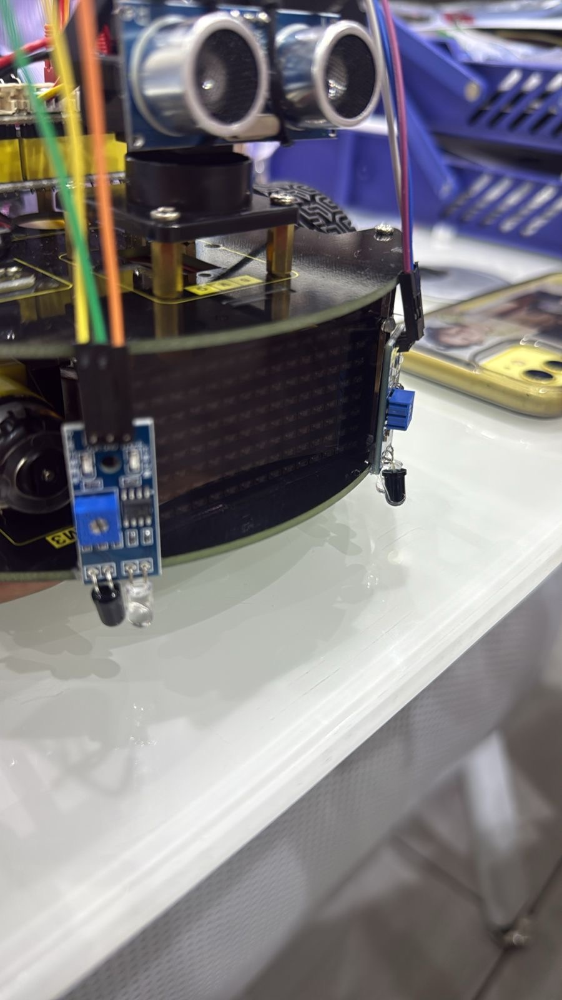
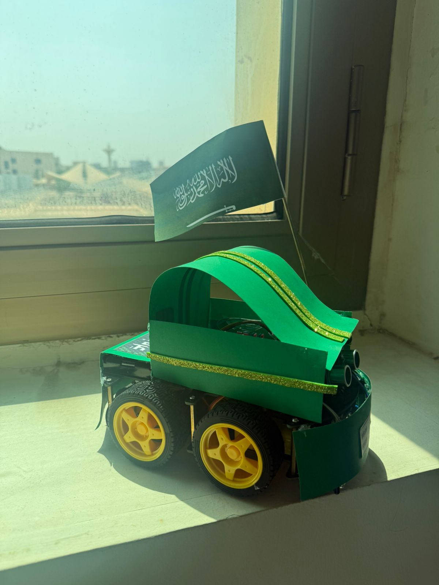
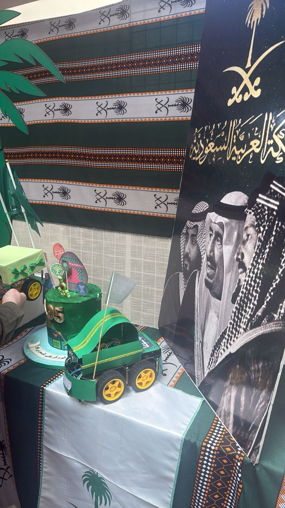
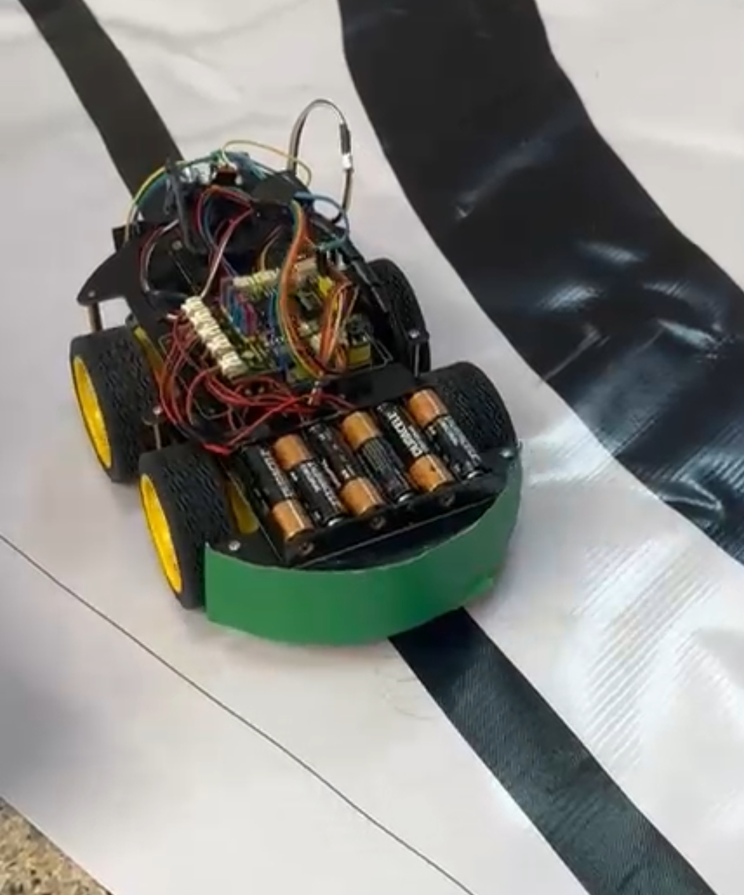

# Autonomous Arduino Maze Robot

An autonomous Arduino-based exploration robot designed for confined maze navigation and obstacle avoidance.

This project uses ultrasonic sensing, servo-based directional scanning, IMU motion tracking, GPS logging, SD-card data recording, Webots simulation, and Wokwi hardware simulation to validate both the robot’s navigation behavior and hardware design.

---

## Project Overview

Confined tunnels and maze-like environments create navigation challenges because of narrow paths, limited visibility, and unexpected obstacles. This project addresses these challenges by building a low-cost autonomous robot that can move through a maze, detect obstacles, choose safer directions, and log sensor data for later analysis.

The robot follows a reactive navigation strategy. It continuously senses the environment, decides whether to move forward or turn, and then executes the movement without using a preloaded map.

---

## Objectives

- Build an autonomous robot for maze-like environments
- Detect and avoid obstacles in real time
- Use ultrasonic sensing with servo-based scanning
- Integrate IMU, GPS, and SD-card logging
- Validate navigation behavior using Webots
- Validate hardware connections using Wokwi
- Test the robot on a physical maze path

---

## Features

- Autonomous maze navigation
- Real-time obstacle detection
- Forward, left, and right movement decisions
- Servo-mounted ultrasonic scanning
- IMU-based motion stability tracking
- GPS coordinate logging
- SD-card data recording
- Webots maze simulation
- Wokwi Arduino hardware simulation
- Physical robot prototype testing

---

## Hardware Components

- Arduino Uno
- HC-SR04 ultrasonic sensor
- Servo motor
- MPU6050 IMU sensor
- NEO-6M GPS module
- SD card module
- L298N motor driver
- DC motors
- Robot chassis
- Battery pack
- IR sensors

---

## Navigation Logic

The robot uses a simple sense-decide-act loop:

1. The ultrasonic sensor scans the front direction.
2. If the path is clear, the robot moves forward.
3. If an obstacle is detected, the robot stops.
4. The servo rotates the ultrasonic sensor to scan right and left.
5. The robot compares both distances.
6. The robot turns toward the side with more available space.
7. The process repeats continuously.

---

## System Pipeline

1. Read ultrasonic distance
2. Check if the path is clear
3. Move forward or stop
4. Scan right and left
5. Choose the direction with greater clearance
6. Continue movement loop
7. Log IMU and GPS data

---

## Robot Prototype

The physical robot was assembled using an Arduino-based mobile platform with ultrasonic sensing, servo-based directional scanning, IR sensors, motor control, and onboard wiring for autonomous navigation.

### Sensor Close-Up

The ultrasonic sensor is mounted at the front of the robot to measure obstacle distance. It supports the robot’s real-time obstacle detection and path selection logic.

### Physical Robot Design

The robot uses a wheeled chassis with a custom green exterior design. The internal wiring and sensors are placed inside the body while keeping the front sensor exposed for navigation.

### Exhibition Display

The robot prototype was presented as part of the project demonstration, showing the final physical build and design.

### Maze Navigation Test

The robot was tested on a maze-like path to evaluate autonomous movement, obstacle avoidance, and turning behavior.

---

## Simulations

### Webots Maze Simulation

Webots was used to validate the robot’s navigation behavior inside a maze environment. The simulation focused on obstacle avoidance, narrow corridors, sharp turns, and motion stability.

The Webots simulation used an E-puck robot model. Since the E-puck does not include all the same sensors as the physical Arduino prototype, Webots was mainly used to test navigation behavior rather than exact hardware replication.

### Wokwi Hardware Simulation

Wokwi was used to validate the Arduino hardware design, wiring, sensor connections, and pin configuration before assembling the physical prototype.

---

## Webots vs Wokwi

| Tool | Purpose |
|---|---|
| Webots | Tests robot movement and maze-navigation behavior |
| Wokwi | Tests Arduino wiring, sensors, and hardware configuration |

---

## Sensor Availability Comparison

| Sensor | Physical Arduino Robot | Webots Simulation |
|---|---|---|
| Ultrasonic HC-SR04 | Yes | No |
| IR sensors | Yes | Limited |
| MPU6050 IMU | Yes | No |
| GPS module | Yes | No |
| SD card module | Yes | No |

---

## Performance Summary

- 94% successful obstacle avoidance
- Stable motion with minimal drift
- Successful sensor data logging
- Effective reactive navigation in maze-like paths

---

## Repository Contents

- README.md
- Webots Maze Navigation.wbt
- WokwiHardware.zip
- Autonomous_Arduino_Based_Exploration_Robot_for_Confined_Maze_Navigation.pdf
- images/robot-sensor-closeup.jpg
- images/robot-side-view.jpg
- images/robot-exhibition-display.jpg
- images/robot-maze-test.jpg
- images/webots-simulation.png
- images/wokwi-hardware.png

---

## How to Run

### Webots Simulation

1. Open Webots.
2. Load `Webots Maze Navigation.wbt`.
3. Run the simulation.
4. Observe the robot’s maze navigation behavior.

### Wokwi Hardware Simulation

1. Extract `WokwiHardware.zip`.
2. Open the Wokwi project files.
3. Check the Arduino wiring and sensor configuration.
4. Run the simulation to validate the hardware setup.

### Physical Robot

1. Upload the Arduino code to the Arduino Uno.
2. Connect the sensors and motors.
3. Power the robot using the battery pack.
4. Place the robot on a maze-like path.
5. Start the robot and observe autonomous navigation.

---

## Technologies Used

- Arduino
- Embedded C / Arduino C++
- Webots
- Wokwi
- Ultrasonic sensing
- Servo control
- IMU sensing
- GPS logging
- SD-card logging
- Reactive robotics

---

## Limitations

- The robot uses reactive navigation instead of full map-based planning.
- GPS is not reliable indoors or inside underground-like environments.
- Webots does not fully replicate the physical Arduino sensor setup.
- The system does not build a complete map of the maze.
- Performance may be affected by uneven surfaces, weak batteries, or noisy sensor readings.

---

## Future Improvements

- Add full maze mapping
- Improve path planning with memory-based navigation
- Add better localization for indoor environments
- Use more advanced sensor fusion
- Improve obstacle detection accuracy
- Add wireless monitoring
- Add real-time dashboard visualization
- Improve the physical enclosure and wiring organization

---

## Team Members

- Alhanouf Alsehli
- Futoon Abuzaid
- Ghala Alotaibi
- Rahaf Jelan
- Shahad Alzahrani

---

## Course / Institution

Department of Computer Science and Artificial Intelligence  
University of Jeddah  
Fall 2025
